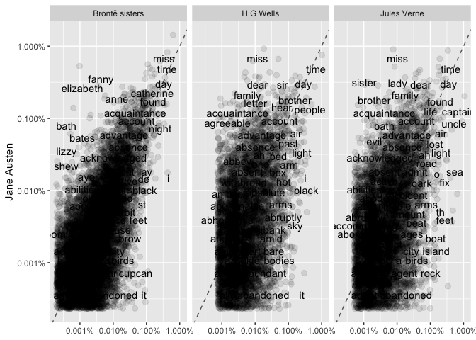

# Text Mining with R

In this repo I log what I am doing working through this book. I hope you enjoy it. 

First let's load some packages.


```r
library(tidyverse)
```

```
## ── Attaching core tidyverse packages ──────────────────────── tidyverse 2.0.0 ──
## ✔ dplyr     1.1.3     ✔ readr     2.1.4
## ✔ forcats   1.0.0     ✔ stringr   1.5.0
## ✔ ggplot2   3.4.3     ✔ tibble    3.2.1
## ✔ lubridate 1.9.2     ✔ tidyr     1.3.0
## ✔ purrr     1.0.2     
## ── Conflicts ────────────────────────────────────────── tidyverse_conflicts() ──
## ✖ dplyr::filter() masks stats::filter()
## ✖ dplyr::lag()    masks stats::lag()
## ℹ Use the conflicted package (<http://conflicted.r-lib.org/>) to force all conflicts to become errors
```

```r
library(tidytext)
library(janeaustenr)
library(scales)
```

```
## 
## Attaching package: 'scales'
## 
## The following object is masked from 'package:purrr':
## 
##     discard
## 
## The following object is masked from 'package:readr':
## 
##     col_factor
```

```r
data(stop_words)
```

## Chapter 1

Let's have a look at which of Ms. Austen's words are her favourites. 


```r
tidy_books <- janeaustenr::austen_books() %>%
  group_by(book) %>%
  mutate(line_number = row_number(),
         chapter = cumsum(str_detect(text,
                                     regex("^chapter [\\divxlc]",
                                    ignore_case = TRUE)))) %>%
  ungroup %>%
  tidytext::unnest_tokens(word,text) %>%
  anti_join(stop_words, by = "word")

tidy_books %>%
  count(word,sort = TRUE)
```

```
## # A tibble: 13,914 × 2
##    word       n
##    <chr>  <int>
##  1 miss    1855
##  2 time    1337
##  3 fanny    862
##  4 dear     822
##  5 lady     817
##  6 sir      806
##  7 day      797
##  8 emma     787
##  9 sister   727
## 10 house    699
## # ℹ 13,904 more rows
```
OK. So the tidy text package includes a function `unnest_tokens()` which is essentially the venerable `Flex` package from `C/C++` but in `R`. Interesting to note that a regex is used to identify chapter headings (again, this is just flex, literally could do this with a DFA). 

ANYWAY.

Let's plot it: 


```r
  tidy_books %>%
  count(word,sort = TRUE) %>%
  filter(n > 600) %>%
  mutate(word = reorder(word,n)) %>%
  ggplot(aes(x = word, y = n)) +
  geom_col() +
  xlab(NULL) +
  coord_flip()
```

<!-- -->

OK. Now move on to someone other than Jane Austen. 


```r
# devtools::install_github("ropensci/gutenbergr")
# LOL managed to get themselves banned from CRAN
library(gutenbergr)

hgwells <- gutenbergr::gutenberg_download(c(35,36,5230,159))
```

```
## Determining mirror for Project Gutenberg from https://www.gutenberg.org/robot/harvest
```

```
## Using mirror http://aleph.gutenberg.org
```

```r
tidy_hgwells <- hgwells %>%
  tidytext::unnest_tokens(word,text) %>%
  anti_join(stop_words, by = "word")

tidy_hgwells %>% count(word,sort = TRUE)
```

```
## # A tibble: 11,811 × 2
##    word       n
##    <chr>  <int>
##  1 time     461
##  2 people   302
##  3 door     260
##  4 heard    249
##  5 black    232
##  6 stood    229
##  7 white    224
##  8 hand     218
##  9 kemp     213
## 10 eyes     210
## # ℹ 11,801 more rows
```

OK. Now what about the Brontë sisters? 


```r
bronte <- gutenbergr::gutenberg_download(c(1260,768,969,9182,767))

tidy_bronte <- bronte %>%
  tidytext::unnest_tokens(word, text) %>%
  anti_join(stop_words, by = "word")

tidy_bronte %>% 
  count(word, sort = TRUE)
```

```
## # A tibble: 23,213 × 2
##    word       n
##    <chr>  <int>
##  1 time    1065
##  2 miss     854
##  3 day      825
##  4 don’t    780
##  5 hand     767
##  6 eyes     714
##  7 night    648
##  8 heart    638
##  9 looked   601
## 10 door     591
## # ℹ 23,203 more rows
```
Right. Lets look for common and also distinctive words for these three authors. I'm also going to grab some of Jules Verne.

```r
verne <- gutenbergr::gutenberg_download(c(164,103,18857))

tidy_verne <- verne %>%
  tidytext::unnest_tokens(word, text) %>%
  anti_join(stop_words, by = "word")

frequency <- 
  tidy_bronte %>% mutate(author = 'Brontë sisters') %>%
  bind_rows(tidy_hgwells %>% mutate(author = 'H G Wells')) %>%
  bind_rows(tidy_books %>% mutate(author = 'Jane Austen')) %>%
  bind_rows(tidy_verne %>% mutate(author = 'Jules Verne')) %>%
  mutate(word = str_extract(word, '[a-z]+')) %>%
  count(author,word) %>%
  group_by(author) %>%
  mutate(proportion = n / sum(n)) %>%
  select(-n) %>%
  spread(key = author, value = proportion) %>%
  gather(key = author, value = proportion, `H G Wells`,`Brontë sisters`,`Jules Verne`)

frequency %>% 
  ggplot(aes(x = proportion, y = `Jane Austen`), color = abs(`Jane Austen`-author)) +
  geom_abline(colour = 'gray40', lty = 2) + 
  geom_jitter(alpha = 0.1, size = 2.5, width = 0.3, height = 0.3) + 
  geom_text(aes(label=word), check_overlap = TRUE, vjust = 1.5) + 
  scale_x_log10(labels = scales::percent_format()) + 
  scale_y_log10(labels = scales::percent_format()) +
  facet_wrap( ~ author) + 
  scale_colour_gradient(limits = c(0,0.001), 
                        low = 'darkslategray4', high = 'gray75') +
  theme(legend.position = 'none') + 
  labs(y = 'Jane Austen', x= NULL)
```

```
## Warning: Removed 70528 rows containing missing values (`geom_point()`).
```

```
## Warning: Removed 70531 rows containing missing values (`geom_text()`).
```

<!-- -->

OK. Now what about some correlations? 

```r
frequency %>% 
  spread(key = author, value = proportion) %>%
  select(-word) %>%
  cor(use = 'pairwise.complete.obs')
```

```
##                Jane Austen Brontë sisters H G Wells Jules Verne
## Jane Austen      1.0000000      0.7284494 0.4104119   0.4242465
## Brontë sisters   0.7284494      1.0000000 0.6551060   0.5003504
## H G Wells        0.4104119      0.6551060 1.0000000   0.4884058
## Jules Verne      0.4242465      0.5003504 0.4884058   1.0000000
```
Interestingly, the only of these authors I can actually enjoy reading (Mr Verne) is most unlike everyone else. 

Using `pairwise.complete.obs` can be tricky but in this case it is OK. If Jane and Jules use a word that noone else does then it is meaningful. I could fill in NAs with zeroes perhaps. Let's try. 


```r
frequency %>%
  spread(key = author, value = proportion) %>%
  gather(key = author, value = proportion, -word) %>%
  mutate(proportion = ifelse(is.na(proportion),0,proportion)) %>%
  spread(key = author, value = proportion) %>%
  select(-word) %>%
  cor
```

```
##                Brontë sisters H G Wells Jane Austen Jules Verne
## Brontë sisters      1.0000000 0.6315854   0.6841685   0.4615129
## H G Wells           0.6315854 1.0000000   0.3892417   0.4611399
## Jane Austen         0.6841685 0.3892417   1.0000000   0.3686690
## Jules Verne         0.4615129 0.4611399   0.3686690   1.0000000
```

So this is relatively interesting. You can infer how many words of these individual authors are unique to their lexicon versus the others by looking at the drop from pairwise complete to putting in zeroes. 
